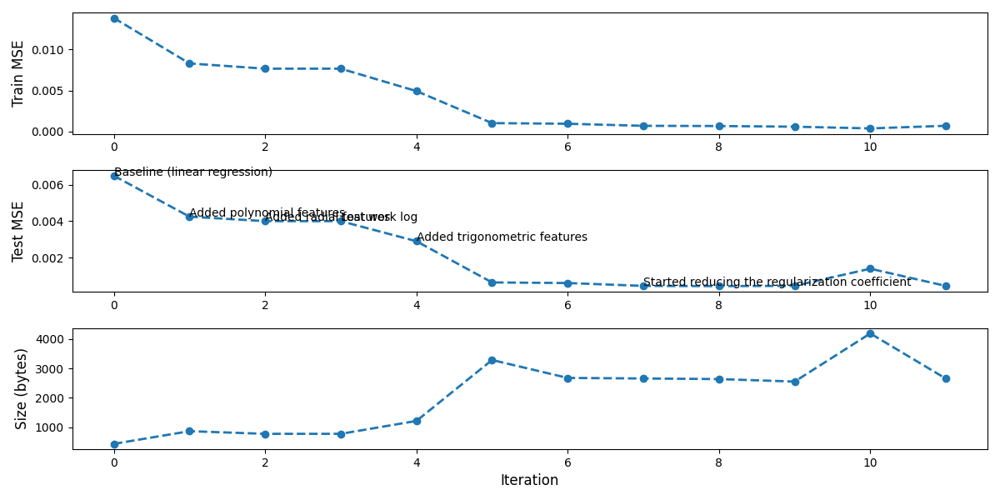
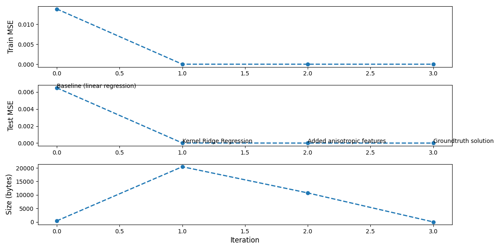

# Run 1

**Model:** MiniMax 2.7

## Iteration 1

**Agent steps:**
1. Read all the provided files in the directory
2. Immediately sees that the dataset is called `three_peaks` and concludes that the model should be non-linear or something with multiple peaks
3. Read `train_dataset.csv` to get general information about the dataset
4. Notice non-linearity and very small numbers
5. Suggest several options: polynomial features, small neural network and tree-based models
6. Write the code to print the range of values (which makes sense) and visualize the dataset via scatter (which does not make sense since the model has no vision modality
7. Notice that the target values are relatively high at the origin and very small at the edges and propose a function of distance from origin based on that
8. Write the code to check the correlation between this distance and the target and conclude that the distance cannot be used directly
9. Again refer to the name `three_peaks` and hesitate between GaussianProcessRegressor and polynomial features
10. Decide to implement polynomial features

**Test MSE:** 0.004247

**Context:** 19552

## Iteration 2

**Agent steps:**
1. Read the existing solution and the work log to understand the task context
2. Propose higher degree polynomials, different regularization, radial distance features, tree-based models, interactions, rbf expansions
3. Mention a mixture of Gaussians explicitly
4. Decide to go on with the radial distance feature r = sqrt(x^2 + y^2)
5. Reduce the features down to x, y and r and polynomial degree 3

**Test MSE:** 0.004002

**Context:** 19530

## Iteration 3

**Agent steps:**
1. Read the existing solution and the work log to understand the task context
2. Propose features sin(3 theta) cos(3 theta) to capture 3-fold ratotaional symmetry believing that the peaks are located at 120 degree circle (i.e., uniformly around the origin)

Train MSE indeed improves, but Test MAE does not reflect it

**Test MSE:** 0.004142

**Context:** 26545 

## Iteration 4 

Our schema has a big disadvantage: the agent has no chance to see the test error dynamics with respect to iterations which is different from the train error dynamics. So starting from this iteration, I added test error to the `work_log.md`

**Agent steps:**
1. Reason a lot about different options related to sin/cos features
2. Leave x, y, sin(3 theta) cos(3 theta) to capture 3-fold ratotaional symmetry

**Test MSE:** 0.002901

**Context:** 28542 

## Iteration 5

**Agent steps:**
1. Add log(1+r) feature, add sin(2 theta) cos (2 theta)

**Test MSE:** 0.000640

**Context:** 28542 

## Iteration 6

**Agent steps:**
1. Removed sin(2 theta) cos (2 theta)

**Test MSE:** 0.000608

**Context:** 32211

## Iteration 7 

**Agent steps:**
1. Reduced alpha from 1e-5 to 1e-10 while keeping degree=5

**Test MSE:** 0.000450

**Context:** 42648

## Iteration 8 

**Agent steps:**
1. Reduced alpha from 1e-10 to 1e-12

**Test MSE:** 0.000438

**Context:** 16421 

## Iteration 9 

**Agent steps:**
1. Reduced alpha from 1e-12 to 0

**Test MSE:** 0.000454

**Context:** 40106

## Iteration 10

**Agent steps:**
1. Added r_squared feature

**Test MSE:** 0.001393

**Context:** 53256 

## Iteration 11

**Agent steps:**
1. Removed r_squared feature and added small regularization

**Test MSE:** 0.000448

**Context:** 33984 

## Conclusion

In this case, the agent was restarted at each iteration implying that its context is flushed. Nonetheless, it has some form of memory kept in `work_log.md`.

First two iterations included reasonable amount of exploration. The agent proposed polynomial features, radial distance features, tree-based methods, RBF expansions, Gaussian processes and a mixture of Gaussians. The agent decided to try polynomial features first and then was stuck with them till the end (adding radial features on the way). The plateau seems to be reached at 11 iterations.

There were no critical problems in running the output of the agent. Perhaps, the only problem is the fact that it occassionally removed the last iteration from `work_log.md` or put its own iteration before the last one.

# Run 2

**Model:** GLM 5.1

## Iteration 1

**Agent steps:**
1. Read all the provided files in the directory
2. Immediately sees that the dataset is called `three_peaks`
3. Performed EDA
4. Gradually developed a solution based on a mixture of Gaussians

**Test MSE:** 0

**Context:** 54701

## Conclusion

The agent solved the task just in one iteration. Perhaps, the dataset name is a too strong hint.

# Run 3

**Model:** GLM 5.1

The dataset was renamed to "abc".

## Iteration 1

**Agent steps:**
1. Read all the provided files in the directory
2. Performed EDA
3. Gradually developed a solution based on Kernel Ridge Regression with RBF kernels
4. Mention that it looks like there is an anisotropic Gaussian

**Test MSE:** 0.000009 

**Context:** 40363 

## Iteration 2

**Agent steps:**
1. Add anisotropic feature scaling for the RBF kernel
2. Use FP32 for the model

**Test MSE:** 0

**Context:** 36996

## Iteration 3

**Agent steps:**
1. Discover a mixture of three Gaussians

**Test MSE:** 0

**Context:** 31787

## Conclusion

Despite focusing on Kernel Ridge Regression from the beginning, the agent managed to find the true solution. Importantly, this time, there is no hint in the dataset name.

# Overall conclusion

## Research questions

- **RQ1**. For this problem, up to 10 iterations is enough to reach a plateau
- **RQ2**. Feature engineering and model selection are the most important ones. Hyperparameter tuning, while bringing performance improvement, does not give much to the agent in terms of problem understanding
- **RQ3**. Both MiniMax 2.7 and GLM 5.1 based agents used table-based EDA extensively (general statistics, data slices, various transformations etc.)

## Future step suggestions

- Automate the agent running. Little information is obtained from monitoring agent's reasoning
- The agent does not seem to cheat. We have never seen it trying to get access to the test dataset
- Any available information is going to be used by the agent. It successfully exploited the fact that the dataset is called "three peaks" even though this was just a part of the path to the csv file.
- MiniMax 2.7 severely underperforms compared to GLM 5.1 so we can stick to the latter in further experiments
- Given that this simple task was successfully solved, we can turn to more sophisticated tasks:
  - Tabular ML problem with no parametric closed-form solution
  - Time series forecasting
  - Law discovery
  - LLM deployment (another repo)
  - DL model optimization (another repo; e.g., we can take our MLP model from DL lectures which tries to fit an oscilatting curve)
