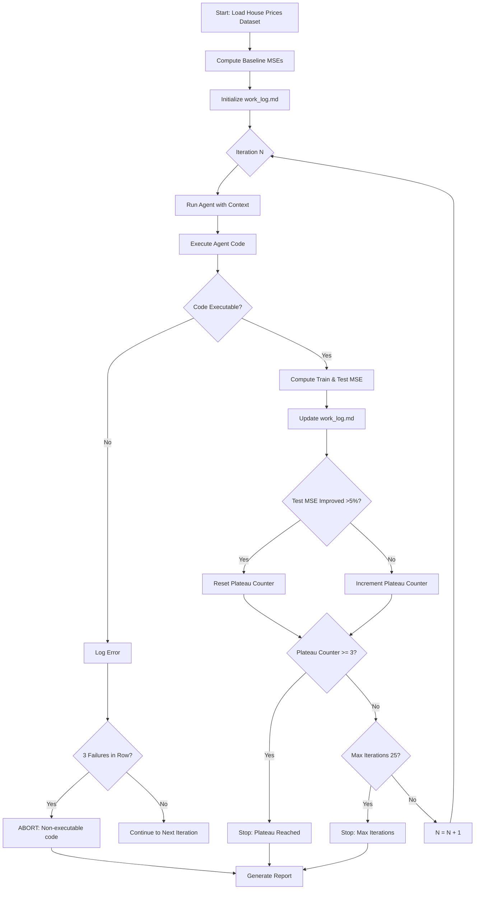

# Spec: Autoresearch on Tabular Regression (House Price Prediction)

## 1. What to do

Test the autoresearch agentic system on the Kaggle House Prices (Advanced Regression) dataset, a real-world tabular regression problem. The agent will optimize the full ML pipeline including feature engineering, model selection, and hyperparameter tuning. Performance will be measured by Test MSE across iterations until a plateau is reached.

## 2. Motivation

The three_peaks dataset from Task 4 was successfully solved but had a clean parametric solution (mixture of Gaussians). Real-world datasets lack closed-form solutions, contain noise, missing values, mixed data types, and complex feature interactions. The House Prices dataset presents practical ML challenges: 79 features with mixed types (numerical, categorical, ordinal), missing data requiring imputation strategies, and non-linear relationships. This tests whether agents can handle messy, real-world regression problems beyond synthetic benchmarks.

## 3. Research questions

### 3.1. RQ1: Optimization trajectory on real-world data

**Question**: How many optimization iterations can the agent support on real-world tabular data before reaching a performance plateau?

**Hypothesis**: Real-world data will require more iterations (15-25) to reach plateau compared to synthetic data (10-11 iterations in Task 4) due to increased complexity and lack of parametric structure.

**Primary metric**: Number of iterations until plateau (defined as 3 consecutive iterations without MSE improvement > 5%)

### 3.2. RQ2: Intervention effectiveness

**Question**: Which intervention types (feature engineering, model selection, hyperparameter tuning, pipeline restructuring) are most effective for agentic improvement on real-world data?

**Hypothesis**: Feature engineering (handling missing values, encoding categoricals, creating interaction features) will contribute more to performance gains than hyperparameter tuning alone, unlike the three_peaks task where regularization tuning dominated later iterations.

**Primary metric**: MSE improvement attributed to each intervention type (tracked via work_log.md analysis)

### 3.3. RQ3: Autonomous ML insight generation

**Question**: Can the agent autonomously generate meaningful theoretical/practical ML insights without external guidance when facing messy, real-world data?

**Hypothesis**: The agent will demonstrate understanding of real-world ML challenges (missing data patterns, categorical encoding strategies, feature interactions) but may struggle with domain-specific feature engineering without explicit knowledge injection.

**Primary metric**: Qualitative analysis of agent reasoning in work_log.md; count of valid ML insights vs. ineffective interventions

### 3.4. RQ4: Cross-dataset performance comparison

**Question**: How does agent performance on real-world data compare to the synthetic three_peaks problem?

**Hypothesis**: Final relative improvement (initial MSE / final MSE) will be lower on House Prices than three_peaks due to irreducible noise and complexity in real-world data.

**Primary metric**: Ratio of final MSE to baseline MSE, compared across datasets

## 4. Baselines

**XGBoost**: Default parameters (common competition baseline)

This baseline will be implemented in a separate exec task and provides a reference point for evaluating agent performance.

## 5. Models

**Primary model**: GLM 5.1
- Selected based on Task 4 results showing superior performance vs. MiniMax 2.7
- GLM 5.1 solved three_peaks in 1-3 iterations vs. 11 iterations for MiniMax 2.7
- Same inference settings as Task 4 for consistency

**Context management**:
- Agent restarts each iteration (context flushed)
- Memory preserved via `work_log.md` (same setup as Task 4)
- Test MSE added to work_log after each iteration (learned from Task 4)

## 6. Datasets

**Dataset**: Kaggle House Prices - Advanced Regression Techniques

**Source**: https://www.kaggle.com/c/house-prices-advanced-regression-techniques

**Type**: Real-world

**Characteristics**:
- **Samples**: 1460 training, 1459 test
- **Features**: 79 (mixed types: numerical, categorical, ordinal)
- **Target**: SalePrice (continuous, right-skewed requiring log transformation)
- **Missing data**: Present in multiple features (e.g., Alley, PoolQC, FireplaceQu)
- **Challenge**: Mixed data types, feature interactions, domain-specific knowledge beneficial

**Data handling**:
- Train/test split will be provided (mimicking Kaggle structure)
- Agent will NOT have access to test labels during optimization
- Test MSE computed after each iteration by orchestrator

## 7. Computational budget

- **CPU**: Standard development machine (no special requirements)
- **GPU**: Not required (inference-only for GLM 5.1 API)
- **RAM**: 8GB sufficient (dataset is small)
- **Disk**: 1GB for code, logs, and intermediate artifacts
- **API calls**: ~15-25 iterations × 1-2 calls per iteration = ~30-50 API calls
- **Estimated runtime**: 2-4 hours total (depending on iteration count)

## 8. Evaluation protocol

### 8.1. Description

1. **Setup phase**:
   - Download and preprocess House Prices dataset
   - Create train/test split (or use Kaggle's provided split)
   - Implement baseline models and record their MSE
   - Set up agent prompt template (same as Task 4)

2. **Execution phase**:
   - Run agent iterations sequentially
   - After each iteration: execute agent's code, compute train and test MSE
   - Append results to work_log.md
   - Continue until plateau (3 iterations without >5% MSE improvement) or max 25 iterations

3. **Analysis phase**:
   - Plot MSE vs. iteration curve
   - Categorize agent interventions by type
   - Analyze work_log.md for ML insights quality
   - Compare final MSE against baselines

4. **Failure conditions** (abort if any occur):
   - Agent produces non-executable code for 3 consecutive iterations
   - Test MSE diverges (increases >50% from baseline)
   - Agent attempts to access test labels (cheating detection)

### 8.2. Flowchart

## 9. Minimum viable output

1. **Complete run log**: All iterations documented with agent reasoning, code, and MSE values
2. **MSE trajectory plot**: Visualization of train/test MSE across iterations
3. **Intervention analysis**: Categorization of agent's optimization strategies by type
4. **Baseline comparison table**: Agent final MSE vs. established baselines
5. **Research question answers**: Explicit answers to RQ1-RQ4 with supporting evidence
6. **Report**: `report.md` summarizing findings

## 10. Implementation plan

1. **Dataset preparation**: Download House Prices dataset, create train/test split, set up data loaders
2. **Baseline implementation**: Implement and evaluate XGBoost baseline
3. **Agent prompt setup**: Adapt Task 4 prompt template for House Prices problem
4. **Orchestration script**: Create runner script that executes agent iterations and logs MSE
5. **Run agent iterations**: Execute full run until plateau or max iterations
6. **Analysis and reporting**: Generate MSE plots, analyze interventions, write final report
