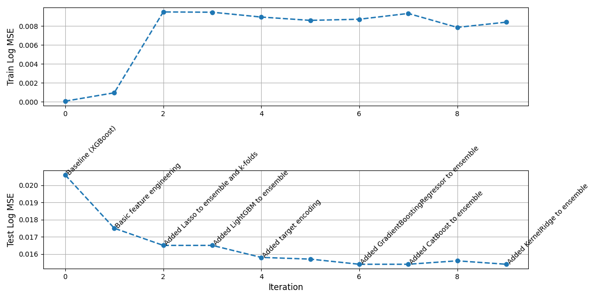
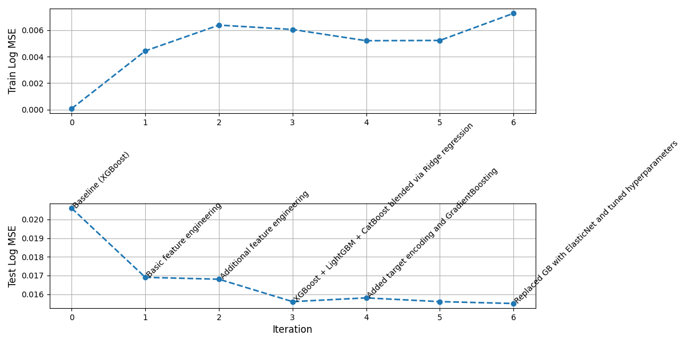

# Run 1

**Model:** GLM 5.1

This is the same type of experiment we did in task 04. Every iteration, we flush the agent's memory so that the work log and the prompt are the only sources of information.

## Iteration 1

**Test MSE:** 1.75e-02

**Context:** 23470 

## Iteration 2

**Test MSE:** 1.65e-02

**Context:** 67409 

## Iteration 3 

**Test MSE:** 1.65e-02

**Context:** 37000 

## Iteration 4

**Test MSE:** 1.58e-02

**Context:** 62378

## Iteration 5 

**Test MSE:** 1.57e-02

**Context:** 36154

## Iteration 6 

**Test MSE:** 1.54e-02

**Context:** 57396

## Iteration 7 

**Test MSE:** 1.54e-02

**Context:** 32000

## Iteration 8 

**Test MSE:** 1.56e-02

**Context:** 75296

## Iteration 9 

**Test MSE:** 1.54e-02

**Context:** 64200

## Conclusion

In this case, the agent was restarted at each iteration implying that its context is flushed. Nonetheless, it has some form of memory kept in `work_log.md`.

In the first iteration, all the obvious changes have been implemented including dropping Id column. The second iteration introduces k-fold cross validation and XGBoost + Lasso ensemble with other modifications. The third iteration added LightGBM to the ensemble and a meta-learner for stacking. The fourth iteration added target encoding and ElasticNet instead of Lasso. After that the agent mostly tried to add more models to the ensemble which did not help much.

K-fold cross validation with more and more base models in the ensemble and hyperparameters becomes very slow. This is an important limitation which should be taken into account. Probably, the workaround is background sessions (and clear timeout limitations).

# Run 2

**Model:** GLM 5.1

This experiment is different. Instead of flushing the agent's memory after each iteration, we execute the "compact" command to reduce the context length. At the same time, the agent still has access to the work log and the prompt information is the same.

## Iteration 1

**Test Log MSE:** 1.69e-02

**Context:** 21327

## Iteration 2 

**Test Log MSE:** 1.68e-02

**Context:** 25063

## Iteration 3 

**Test Log MSE:** 1.56e-02

**Context:** 28422

## Iteration 4

**Test Log MSE:** 1.58e-02

**Context:** 29591

## Iteration 5

**Test Log MSE:** 1.56e-02

**Context:** 44246

## Iteration 5

**Test Log MSE:** 1.55e-02

**Context:** 41209 

## Conclusion

This approach is more efficient both in terms of the number of iterations and the token usage but the main problem is that GLM 5.1 freezes too often which may be just an API issue. The set of explored ideas is roughly the same as when we used restarts (run 1). The final solution is a bit worse than that in run 1 where the agent consistently achieved 1.54e-02.

# Overall conclusion

The final solution in both runs is roughly a top-10% / top-15% solution on Kaggle which is solid result.

## Research questions

- **RQ1**. For this problem, up to 10 iterations is enough to reach a plateau
- **RQ2**. Feature engineering and model selection are the most important ones. Hyperparameter tuning, while bringing performance improvement, does not give much to the agent in terms of problem understanding
- **RQ3**. In this particular problem, the agent used some basic EDA and not very often (just to analyze outliers and missing values)

## Future step suggestions

We have covered two ML problem: continuous regression (three peaks) and tabular ML (house prices). We could consider the following as the next steps:
- Time series forecasting (e.g., Store Sales: https://www.kaggle.com/competitions/store-sales-time-series-forecasting/overview )
- Law discovery
- LLM deployment (another repo)
- DL model optimization (another repo; e.g., we can take our MLP model from DL lectures which tries to fit an oscilatting curve)
- Use multi-agent approach. It is obvious now that there is a lack of diversity in the provided solutions. The multi-agent approach could fix this and provide a better result in the end
